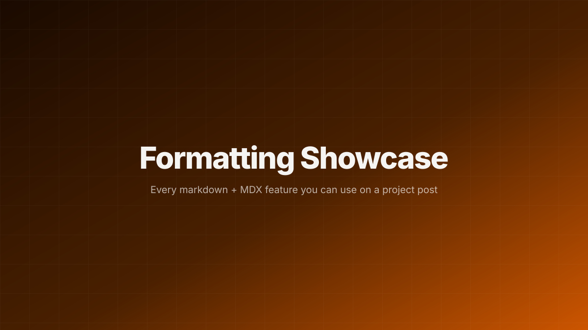

import { Image } from 'astro:assets'
import placeholder from './thumbnail.svg'

This post exists purely to demonstrate what's possible in the body of a project
article. The Table of Contents on the right is generated automatically from the
`h2` and `h3` headings below.

## Headings auto-populate the TOC

The article `h1` is pulled from the `title` field in frontmatter. Inside the
body, start at `h2` and nest with `h3`. The right-side (or inline, on narrow
screens) **Table of Contents** is built from the combination of `h2` + `h3`.

### Sub-headings appear indented

TOC entries for `h3` are nested below their parent `h2`.

#### h4 renders but does not appear in the TOC

##### h5 and h6

Use these for very deep nesting.

## Text formatting

Paragraphs use Inter Light at 17px with generous line-height. You have
**bold text**, _italic text_, **_bold italic together_**, ~~strikethrough~~,
and `inline code spans`.

Combine freely: a **bold** phrase with an `inline snippet` that links to
[the projects index](/projects) or to an external page like
[Astro's docs](https://docs.astro.build). Both internal and external links
render in the accent color with an underline.

## Lists

Unordered, with nesting:

- First bullet
- Second bullet with some **bold** inside
  - Nested bullet
  - Another nested bullet with [a link](/photo)
- Third bullet

Ordered, with nesting:

1. First numbered item
2. Second numbered item
   1. Nested step
   2. Another nested step
3. Third numbered item

GFM task list:

- [x] Set up content collections
- [x] Wire up the TOC generator
- [ ] Write a real post to replace this one
- [ ] Celebrate

## Code blocks with syntax highlighting

Inline code: `const x = 42`.

Fenced blocks get Shiki highlighting when you specify a language:

```ts
interface Project {
  slug: string;
  title: string;
  pubDate: Date;
  tags: string[];
}

function isPinned<T extends { pin?: boolean }>(p: T): boolean {
  return p.pin === true;
}
```

```python
from dataclasses import dataclass

@dataclass
class Reading:
    sensor_id: str
    value: float
    timestamp: float

    def as_si(self) -> float:
        """Return value converted to SI units."""
        return self.value * 1.0
```

```bash
# Common workflow
npm install
npm run dev
# Clean the Astro content cache if HMR gets stuck
rm -rf .astro node_modules/.vite
```

```yaml
# Example frontmatter
title: 'Example post'
pubDate: 2026-04-17
tags:
  - Engineering
  - CAD
pin: true
```

Language-less fence renders as plain monospace:

```
Just a plain preformatted block.
No highlighting, no language tag.
```

## Blockquotes

> Single-paragraph quotes render with an orange left border and slight italic.

> Multi-paragraph quotes work too.
>
> Keep the `>` prefix on the blank line between paragraphs so they stay as one
> blockquote block.

## Horizontal rule

Use three or more hyphens on a line alone:

---

## Images — plain markdown (uncompressed pass-through)

Plain markdown syntax renders the original file bytes, no resizing or
transcoding:



## Images — Astro `<Image />` (optimized)

Imported images give you typed width/height and you can hand them to Astro's
`<Image />` component for responsive output:

<Image
	src={placeholder}
	alt="Optimized placeholder rendered through astro:assets"
	width={1200}
	sizes="(max-width: 900px) 100vw, 880px"
/>

## Tables

GFM tables with alignment control via the `:` placement in the separator row:

| Field         | Type    | Required | Notes                                    |
| :------------ | :-----: | :------: | :--------------------------------------- |
| `title`       | string  |   yes    | Appears as the H1 on the post page       |
| `description` | string  |    —     | Shown on cards and as the lead paragraph |
| `pubDate`     | date    |    —     | Used for recency sort                    |
| `tags`        | string[]|    —     | Drive the Topics section on /projects    |
| `pin`         | bool    |    —     | Adds pin icon + Pinned column placement  |

Column alignment:

| Left-aligned | Center | Right-aligned |
| :----------- | :----: | ------------: |
| small        |  mid   |           big |
| tiny         | middle |         huge  |

## Footnotes

You can reference footnotes like this[^toc] or this[^pins] and Astro renders
definitions at the bottom of the page with back-links.

[^toc]: The TOC is built in `src/components/Toc.astro` from the headings array
		returned by `render(entry)`. Short posts (under two `h2`+`h3` headings)
		skip the TOC entirely.
[^pins]: Pinning is just a frontmatter boolean. The Pinned column on /projects
		filters to `pin === true`, and every card renders a small pin badge next
		to the title.

## Autolinks

Bare URLs become clickable automatically: https://astro.build/ or
https://github.com/lukegoldmeyer.

## Escaping

Backslashes defeat markdown syntax when you want literal characters:
\*not italic\*, \`not inline code\`, \[not a link\](noop.html).

## Search demo

Want to test the ⌘K palette? Search for something that only appears in this
body, like **"rhinoceros"** or **"perambulate"** — those two tokens live
nowhere else on the site, so matching them proves body-level indexing works.

## Tips if you remix this post

- Copy the whole `formatting-showcase/` folder, rename it, strip the parts you
  don't want, and you've got a styled starter.
- The `thumbnail.svg` here is just a placeholder — swap it with a real photo
  any time.
- Remove `pin: true` if you don't want this floating to the top of /projects.
